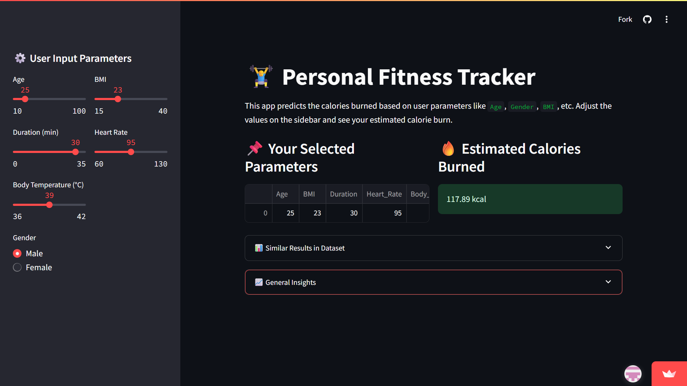
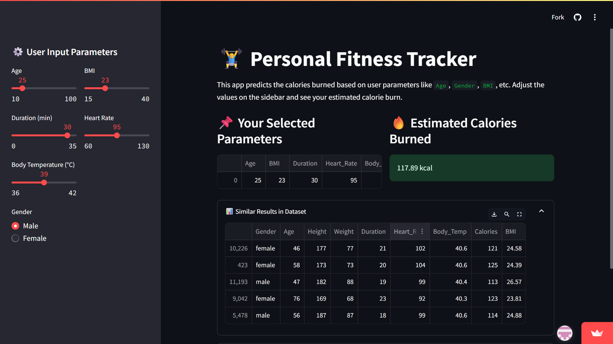
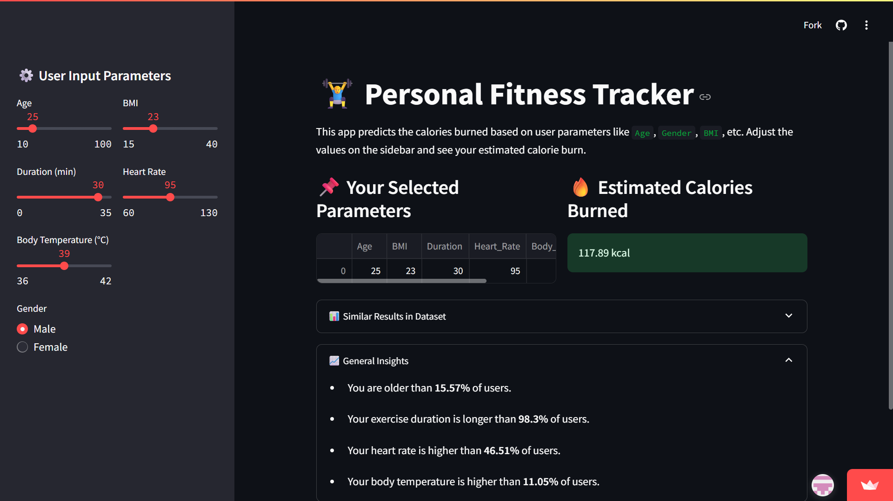

<div align="center">

# 🏋️ AI-Powered Personal Fitness Tracker

### Predict Calories Burned using Machine Learning & Streamlit

<p>
  <a href="https://manas-fitness-tracker.streamlit.app">
    
  </a>

  

  

  

  

</p>

Developed during **TechSaksham AI Internship**.

</div>

---

# 📖 About The Project

This project is an **AI-powered Personal Fitness Tracker** that predicts the estimated calories burned based on physiological and fitness-related parameters.

Instead of relying on traditional fixed formulas, this application uses a **Random Forest Regressor** trained on fitness data to provide personalized calorie predictions.

The application is built with **Python**, **Scikit-learn**, and **Streamlit**, offering an interactive dashboard where users can input their fitness details and instantly receive predictions.

---

# ✨ Features

- 🔥 AI-powered calorie prediction
- 🤖 Random Forest Machine Learning model
- 📊 Interactive Streamlit dashboard
- 📈 Similar records from dataset
- 💡 Personalized fitness insights
- 🌐 Live deployment on Streamlit Cloud
- ⚡ Fast and responsive interface

---

# 🚀 Live Demo

### 🌍 Try the application here

**https://manas-fitness-tracker.streamlit.app**

---

# 📸 Project Screenshots

## 🏠 Home Screen



---

## 📊 Calories Prediction



---

## 💡 Personalized Insights



---

# 🧠 Machine Learning Model

### Algorithm Used

✅ Random Forest Regressor

### Why Random Forest?

Random Forest was selected because it:

- Handles complex non-linear relationships
- Produces more accurate predictions
- Reduces overfitting
- Works well with structured datasets
- Is robust against noisy data

---

# 📥 Input Parameters

The model predicts calories burned using:

| Feature | Description |
|----------|-------------|
| Age | User age |
| Gender | Male/Female |
| BMI | Body Mass Index |
| Duration | Exercise duration (minutes) |
| Heart Rate | Heart beats per minute |
| Body Temperature | Body temperature |

### Output

Estimated Calories Burned (kcal)

---

# ⚙️ Application Workflow

```text
User Input
      │
      ▼
Data Preprocessing
      │
      ▼
Random Forest Model
      │
      ▼
Calories Prediction
      │
      ▼
Dataset Comparison
      │
      ▼
Fitness Insights
```

---

# 🛠 Tech Stack

| Category | Technology |
|----------|------------|
| Language | Python |
| Machine Learning | Scikit-learn |
| Model | Random Forest Regressor |
| Data Processing | Pandas, NumPy |
| Visualization | Matplotlib,Seaborn |
| Web Framework | Streamlit |
| Deployment | Streamlit Cloud |
| Version Control | Git & GitHub |

---

# 📂 Project Structure

```text
fitness-tracker-ml/

│── assets/
│   ├── home.png
│   ├── prediction.png
│   └── insights.png

│── app.py

│── calories.csv

│── exercise.csv

│── requirements.txt

│── README.md
```

---

# 🚀 Installation

Clone the repository

```bash
git clone https://github.com/Manassahu01/fitness-tracker-ml.git
```

Go to project directory

```bash
cd fitness-tracker-ml
```

Install dependencies

```bash
pip install -r requirements.txt
```

Run the application

```bash
streamlit run app.py
```

---

# 🎯 Future Improvements

- 📱 Android & iOS App
- ⌚ Smartwatch Integration
- ❤️ Fitbit API
- 🍎 Apple Health Integration
- 🥗 Diet Recommendation System
- 🏃 Workout Recommendation Engine
- 🧠 Deep Learning Models
- ☁ Cloud Database
- 👤 User Login System

---

# 📚 Project Report

This project was completed as part of the **TechSaksham AI Internship**.

The repository also includes the complete project report covering:

- Problem Statement
- Literature Review
- System Design
- Methodology
- Results
- Future Scope

---

# 👨‍💻 Author

## Manas Sahu

🎓 Final Year BCA Student

📊 Aspiring Data Analyst

🤖 Machine Learning Enthusiast

📧 **Email**

manassahu10107@gmail.com

💼 **LinkedIn**

https://www.linkedin.com/in/manas-sahu-426649284

---

# 🌟 Support

If you found this project helpful, please consider giving it a ⭐ on GitHub.

It motivates me to build more useful Machine Learning and Data Analytics projects.

---

<div align="center">

### ⭐ Thank you for visiting this repository!

Made with ❤️ by **Manas Sahu**

</div>
